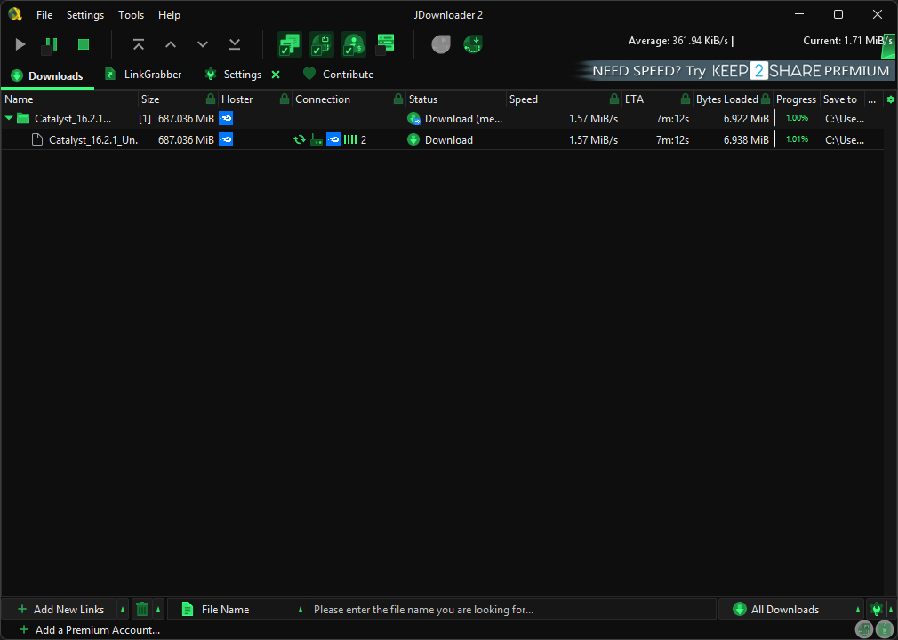
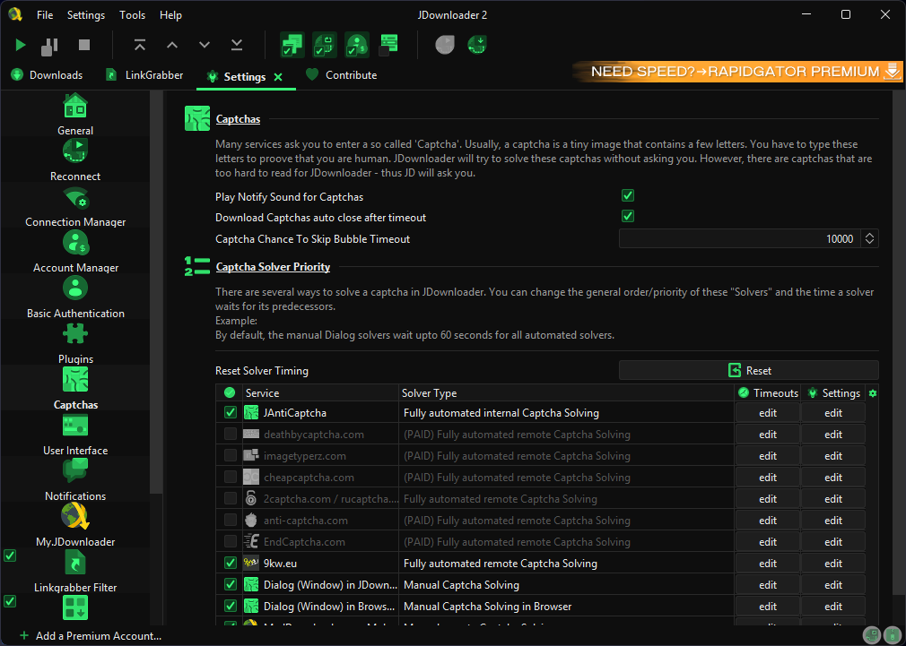
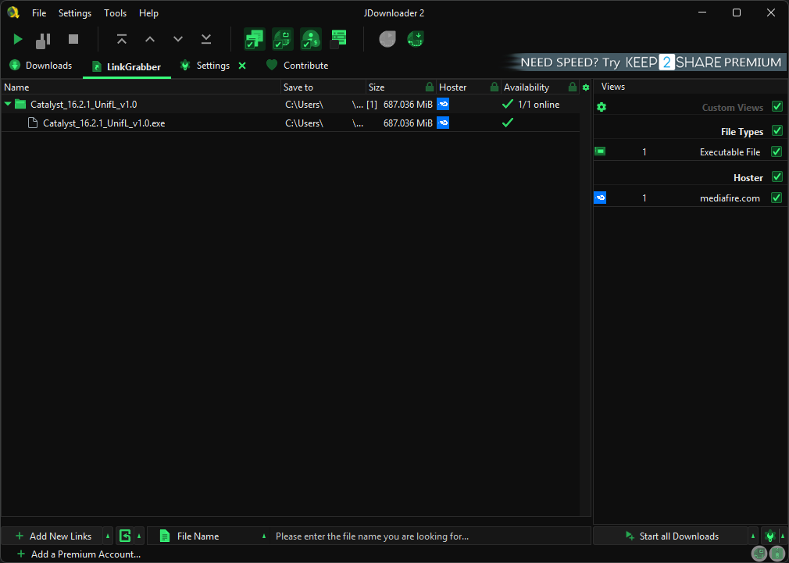

# Phosphor — A Dark Neon Theme for JDownloader 2

A neon green terminal-style theme for JDownloader 2. Inspired by CRT phosphor monitors, Matrix, and Fallout terminals.





---

## What it looks like

- Near-black backgrounds (`#0e0e0e`) with layered dark surfaces
- Neon green (`#39ff7a`) accent on selected rows, progress bars, tabs, icons
- Monochromatic green icon set (250+ icons)
- Full dark chrome — menus, toolbars, scrollbars, checkboxes, tooltips

---

## Files

| File | Description |
|---|---|
| `FlatPhosphor.jar` | Main theme file — colors, icons and class bundled |
| `Phosphor.json` | **Required** — per-LAF settings JD2 reads from `cfg\laf\`: icon set id (`phosphor`) + all GUI colors (panels, tables, progress bars, speed meter) |
| `FlatDarkLaf.json` | Same colors for JD2's built-in Flat Dark LAF (optional, only if you use Flat Dark without the custom class) |
| `images\` | Icon set (used for manual installation) |
| `src\Phosphor.java` | Theme class source |
| `src\Phosphor.properties` | FlatLaf color properties |

> **Important:** `Phosphor.json` is what makes the theme actually look right. Without it, JDownloader loads the theme class but keeps default colors and no green icons.

---

## Installation

0. Go to **Code** (green button above) → **Download ZIP**
1. Right-click your JDownloader 2 shortcut → **Properties** → **Open File Location**
2. Extract the ZIP you downloaded
3. Close JDownloader 2 completely
4. Copy `FlatPhosphor.jar` to `JDownloader 2\libs\laf\`
5. Create `JDownloader 2\cfg\laf\` if it doesn't exist, then copy **both** `Phosphor.json` and `FlatDarkLaf.json` there
6. Create `JDownloader 2\themes\phosphor\org\jdownloader\images\` and copy the contents of the `images\` folder there
7. Open JDownloader 2
8. Go to `Settings → Advanced Settings`
9. Search `customlookandfeelclass` → set value to `com.github.deviceargent.phosphor.Phosphor`
10. Search `iconsetid` → set value to `phosphor`
11. Restart JDownloader 2

### After a JDownloader update

JDownloader may overwrite files in `libs\laf\` after an automatic update. If the theme reverts:
1. Copy `FlatPhosphor.jar` back to `libs\laf\`
2. Verify `cfg\laf\Phosphor.json` is still there (it survives updates, but check anyway)
3. Verify `customlookandfeelclass` and `iconsetid` settings are still set
4. Restart JDownloader 2

Keep a backup of the files somewhere easy to find.

### Troubleshooting: theme loads but colors/icons are wrong

If after restarting you get default gray/dark colors and no green icons, your `cfg\laf\*.json` files are missing or stale:

1. Make sure `Phosphor.json` and `FlatDarkLaf.json` were copied into `JDownloader 2\cfg\laf\`
2. If still wrong: open `Settings → User Interface → Look and Feel`, select **FlatLaf Dark** and apply — JDownloader will (re)generate its `FlatDarkLaf.json` with the base background palette
3. Then set `customlookandfeelclass` back to `com.github.deviceargent.phosphor.Phosphor` and `iconsetid` back to `phosphor`
4. Restart JDownloader 2

---

## Paths by OS

**Windows:**
```
%LOCALAPPDATA%\JDownloader 2\libs\laf\
%LOCALAPPDATA%\JDownloader 2\cfg\laf\
%LOCALAPPDATA%\JDownloader 2\themes\phosphor\org\jdownloader\images\
```

**Linux:**
```
~/JDownloader2/libs/laf/
~/JDownloader2/cfg/laf/
~/JDownloader2/themes/phosphor/org/jdownloader/images/
```

**macOS:**
```
~/Library/JDownloader 2/libs/laf/
~/Library/JDownloader 2/cfg/laf/
~/Library/JDownloader 2/themes/phosphor/org/jdownloader/images/
```

---

## Building from source

Requirements: JDK 8+, `flatlaf.jar` from your JDownloader 2 `libs\laf\` folder.

```
cd phosphor-build
mkdir bin
javac -cp "path\to\flatlaf.jar" -d bin src\com\github\deviceargent\phosphor\Phosphor.java
copy src\com\github\deviceargent\phosphor\Phosphor.properties bin\com\github\deviceargent\phosphor\
jar cvf FlatPhosphor.jar -C bin . -C . themes
```

---

## Credits

**FlatLaf** — Java Swing Look and Feel library  
© JFormDesigner GmbH  
Licensed under the [Apache License 2.0](https://www.apache.org/licenses/LICENSE-2.0)  
https://www.formdev.com/flatlaf/

**Icon set** — Based on material-darker-jdownloader by moktavizen  
Licensed under the [MIT License](https://opensource.org/licenses/MIT)  
https://github.com/moktavizen/material-darker-jdownloader  
Icons recolored to neon green (#39ff7a) for this theme.

**Theme colors and Phosphor.properties** — Original work, free to use and redistribute.

Special thanks to **jiaz** from the JDownloader team for guidance on the theming system.

---

## License

Phosphor is distributed under the [MIT License](https://opensource.org/licenses/MIT).

`FlatPhosphor.jar` includes FlatLaf under Apache 2.0 and icons under MIT.

---

## Notes

👤 <ins>Author</ins>

DeviceArgent


- The official JDownloader 2 logo icon intentionally retains its original orange/yellow color as a visual anchor and out of respect for the JDownloader project.
- Tested on Windows 10/11. Should work on Linux and macOS with path adjustments.
- Official integration as `FLATLAF_PHOSPHOR` in the JDownloader theme list is currently in progress with the JDownloader team.
